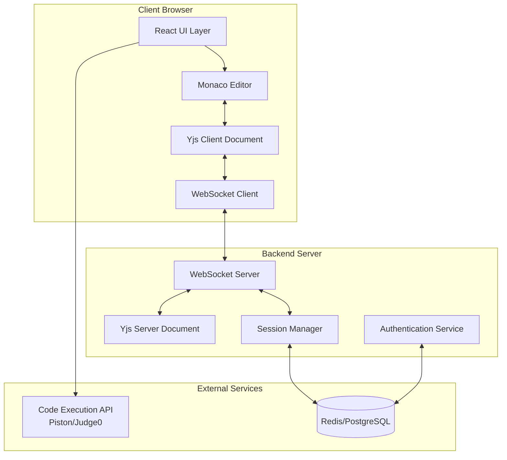
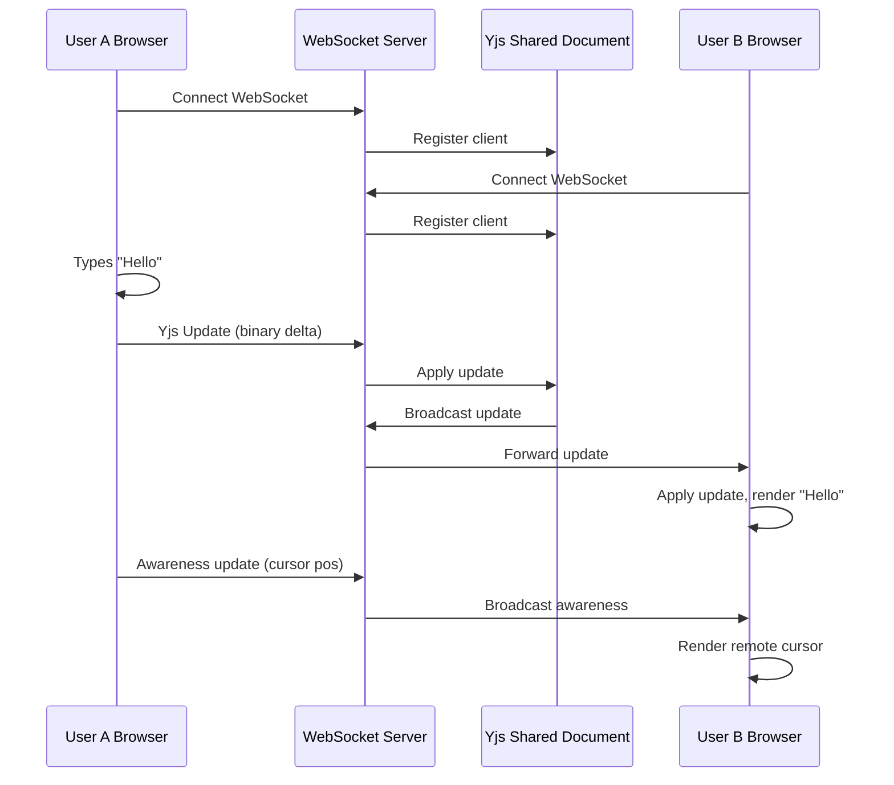
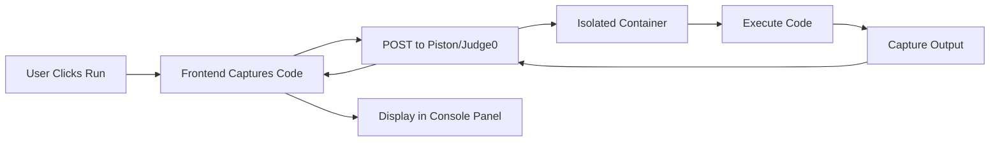
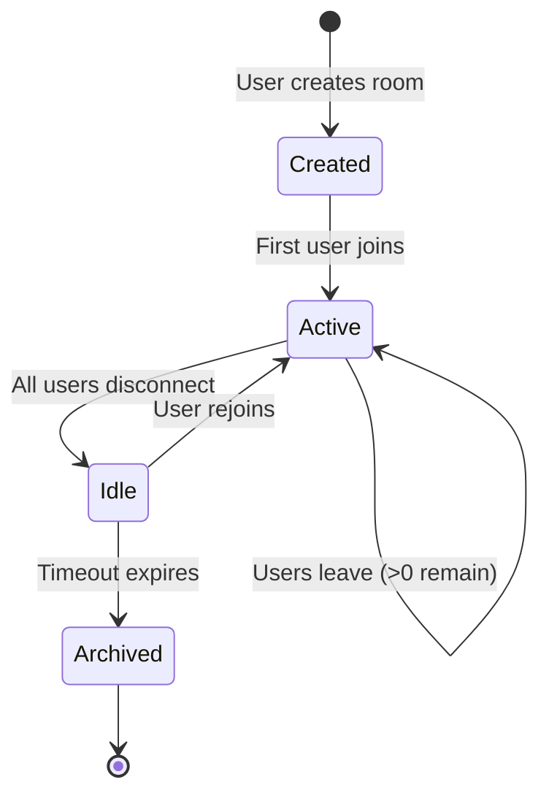
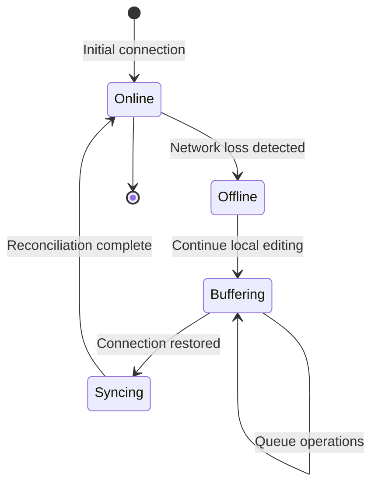

# CoCode - Real-time Collaborative Code Editor

## Project Overview

### Vision Statement
A web-based multi-user real-time collaborative code editor that enables developers to create rooms and invite others via link sharing. Multiple users can simultaneously edit the same code, instantly view each other's cursor positions and selections, with support for syntax highlighting, code execution, and instant messaging.

### Core Value Proposition
Resolves distributed concurrent editing conflicts in multi-user environments, delivering sub-millisecond real-time synchronization experience.

### Key Capabilities
- Real-time collaborative editing with conflict-free synchronization
- Live cursor and selection tracking across all participants
- Syntax highlighting for multiple programming languages
- Code execution in isolated sandbox environment
- Instant messaging between collaborators
- Room-based session management with shareable links

## Technology Stack

### Frontend
| Component | Technology | Rationale |
|-----------|-----------|-----------|
| Framework | React 18 + TypeScript | Type safety for large-scale project maintenance, modern concurrent features |
| Build Tool | Vite | Superior development experience with instant HMR, optimized production builds |
| Code Editor | Monaco Editor | VS Code engine, professional-grade editing experience, comprehensive language support |
| UI Framework | Tailwind CSS | Utility-first approach, rapid prototyping, modern CSS practices |
| State Management | React Context + Hooks | Sufficient for real-time state propagation without additional complexity |

### Backend
| Component | Technology | Rationale |
|-----------|-----------|-----------|
| Runtime | Node.js | Event-driven architecture ideal for real-time applications |
| Framework | Express / NestJS | Express for rapid development, NestJS for enterprise-grade architecture |
| Communication Protocol | WebSocket (ws/socket.io) | Full-duplex communication essential for real-time collaboration |
| Session Storage | Redis (optional) | Temporary state management for collaborative sessions |

### Core Algorithm
| Component | Technology | Rationale |
|-----------|-----------|-----------|
| Conflict Resolution | CRDT (Yjs) | Industry-standard eventual consistency algorithm, proven performance |
| Integration Libraries | y-websocket, y-monaco | Seamless binding between Yjs and Monaco Editor |

**Strategic Decision**: Operational Transformation (OT) is not implemented from scratch due to extreme algorithmic complexity and bug susceptibility. Yjs provides production-ready CRDT implementation with superior performance characteristics.

## System Architecture

### High-Level Component Diagram

### Communication Flow

## Core Functional Modules

### Module 1: Real-time Collaborative Editing

#### Objective
Enable conflict-free concurrent editing where changes made by any user are instantly reflected to all connected participants with guaranteed eventual consistency.

#### Technical Challenge
Concurrent conflict resolution: When User A inserts text at line 1 while User B simultaneously deletes content at the same location, the system must ensure both clients converge to an identical final state without manual conflict resolution.

#### Solution Approach
- **CRDT Integration**: Document modeled as Yjs SharedType (Y.Text)
- **Automatic Merging**: Network updates automatically merged through commutative operations
- **Item-based Model**: Each edit operation represented as an Item with unique Lamport timestamp
- **Network-agnostic**: Update application order-independent, ensuring consistency regardless of packet arrival sequence

#### Data Synchronization Strategy

| Scenario | Handling Mechanism |
|----------|-------------------|
| Initial Connection | Full document state sync via snapshot + incremental updates |
| Concurrent Edits | CRDT algorithm ensures convergence without locking |
| Network Latency | Optimistic UI updates, automatic reconciliation on acknowledgment |
| Disconnection | Local operations queued, synchronized upon reconnection |

### Module 2: Collaborative Awareness (Remote Cursors & Selections)

#### Objective
Provide real-time visibility of collaborator presence, cursor positions, and text selections with participant identification.

#### Implementation Strategy
- **Awareness Protocol**: Utilize Yjs Awareness mechanism for ephemeral state broadcasting
- **Temporary State**: Cursor positions, selection ranges, user names, and color assignments transmitted without persistence
- **Low-latency Requirement**: Sub-100ms propagation target for seamless visual feedback
- **Visual Representation**: Floating nameplate labels at cursor positions, colored selection overlays

#### Awareness Data Structure

| Field | Type | Purpose |
|-------|------|---------|
| userId | String | Unique participant identifier |
| userName | String | Display name shown near cursor |
| cursorPosition | Object {line, column} | Current caret location |
| selectionRange | Object {start, end} | Highlighted text range |
| color | String (hex) | User-specific visual identifier |

### Module 3: Code Execution Engine

#### Objective
Enable in-browser code execution with output display while maintaining security isolation.

#### Security Constraint
Direct server-side code execution poses severe injection vulnerabilities and resource exhaustion risks.

#### Solution Architecture
- **External Sandbox API**: Delegate execution to third-party isolated environments
- **API Options**: Piston API or Judge0 API (open-source sandboxed execution services)
- **Request Flow**: Frontend submits code + language → API executes in container → Returns stdout/stderr/error
- **Timeout Protection**: Execution time limits enforced by external service

#### Execution Workflow

#### Supported Operations

| Operation | Description |
|-----------|-------------|
| Language Selection | User specifies runtime (JavaScript/Python/Java/C++/etc.) |
| Code Submission | Current editor content sent to execution API |
| Output Rendering | stdout displayed in integrated console component |
| Error Handling | Compilation errors and runtime exceptions displayed with formatting |

### Module 4: Session Management

#### Objective
Manage collaborative editing rooms with unique identifiers, participant tracking, and invitation mechanisms.

#### Room Lifecycle

#### Room Management Operations

| Operation | Behavior |
|-----------|----------|
| Room Creation | Generate unique room ID, initialize empty Yjs document |
| Invitation Link | Construct shareable URL containing room ID |
| Participant Join | WebSocket connection + Yjs sync handshake |
| State Persistence | Periodic snapshot to database for recovery |
| Room Closure | Archive document after configurable inactivity period |

### Module 5: Instant Messaging (Optional Enhancement)

#### Objective
Provide text-based communication channel within collaborative session.

#### Implementation Notes
- **Transport**: Utilize existing WebSocket connection for message delivery
- **Message Types**: Text messages, system notifications (user join/leave)
- **UI Placement**: Collapsible side panel or bottom drawer
- **History**: In-memory storage during active session, no long-term persistence required

## Data Model

### Database Schema

#### Users Table
| Field | Type | Constraints | Purpose |
|-------|------|-------------|---------|
| userId | UUID | Primary Key | Unique user identifier |
| userName | VARCHAR(50) | NOT NULL | Display name |
| email | VARCHAR(100) | UNIQUE | Authentication credential |
| passwordHash | VARCHAR(255) | NOT NULL | Encrypted password |
| createdAt | TIMESTAMP | DEFAULT NOW() | Account creation time |

#### Documents Table
| Field | Type | Constraints | Purpose |
|-------|------|-------------|---------|
| documentId | UUID | Primary Key | Unique document identifier |
| roomId | VARCHAR(20) | UNIQUE | Human-readable room identifier |
| creatorId | UUID | Foreign Key → Users | Document owner |
| language | VARCHAR(20) | NOT NULL | Programming language |
| snapshotContent | TEXT | NULLABLE | Latest document state snapshot |
| lastUpdated | TIMESTAMP | DEFAULT NOW() | Last modification time |
| createdAt | TIMESTAMP | DEFAULT NOW() | Document creation time |

**Note on Persistence Strategy**: 
- Yjs maintains in-memory document state during active sessions
- Periodic snapshots stored in database for crash recovery and historical reference
- Full edit history can be preserved via Yjs update logs (optional advanced feature)

### Redis Session Cache (Optional)

| Key Pattern | Value Type | Purpose | TTL |
|-------------|------------|---------|-----|
| `session:{roomId}` | Hash | Active participant list | 24 hours |
| `presence:{roomId}` | Set | Currently connected user IDs | 1 hour |
| `snapshot:{documentId}` | String | Compressed document state | 7 days |

## Development Roadmap

### Phase 1: Static Editor Foundation (Days 1-2)

**Objectives**:
- Establish project infrastructure with modern tooling
- Integrate professional-grade code editor component
- Implement basic UI layout and navigation

**Key Deliverables**:
1. Initialize React 18 + TypeScript project via Vite
2. Install and configure @monaco-editor/react
3. Create full-screen editor interface with language selector
4. Implement Tailwind CSS theming and responsive layout

**Success Criteria**: Functional local code editor supporting JavaScript/Python/Java syntax highlighting

### Phase 2: WebSocket & Yjs Integration (Days 3-5) — Critical Path

**Objectives**:
- Establish real-time communication infrastructure
- Implement CRDT-based conflict resolution
- Achieve multi-client synchronization

**Key Deliverables**:
1. Deploy Node.js WebSocket server using y-websocket
2. Install frontend dependencies: yjs, y-websocket, y-monaco
3. Bind Monaco Editor Model to Yjs Y.Text type
4. Configure synchronization provider and connection management

**Success Criteria**: Opening two browser windows demonstrates character-level synchronization with <500ms latency

### Phase 3: Collaborative Awareness (Day 6)

**Objectives**:
- Visualize remote user presence
- Display real-time cursor positions and selections

**Key Deliverables**:
1. Configure Yjs Awareness protocol
2. Generate unique user colors and temporary names
3. Render remote cursor widgets in Monaco Editor
4. Implement selection range highlighting with color coding

**Success Criteria**: Remote cursors visible with associated user identifiers, movements synchronized in real-time

### Phase 4: Code Execution & UI Polish (Days 7-9)

**Objectives**:
- Enable code execution functionality
- Enhance user experience and shareability
- Prepare for production deployment

**Key Deliverables**:
1. Integrate Piston API client for code execution
2. Create console output panel component
3. Implement "Copy Invitation Link" feature
4. Apply UI refinements and error handling
5. Configure production build and deployment pipelines

**Success Criteria**: End-to-end collaborative editing session with code execution and polished interface

### Deployment Strategy

| Component | Platform | Configuration |
|-----------|----------|---------------|
| Frontend | Vercel | Automatic deployment from Git repository |
| Backend | Heroku / Alibaba Cloud | WebSocket server with auto-scaling |
| Database | Managed PostgreSQL | Cloud provider's managed service |
| Redis | Redis Cloud / ElastiCache | Ephemeral session storage |

## Technical Deep Dive

### CRDT Conflict Resolution Mechanism

**Problem Statement**: When User A and User B simultaneously edit the same document position, traditional last-write-wins approaches cause data loss.

**CRDT Solution Principles**:
1. **Commutativity**: Operations can be applied in any order yielding identical results
2. **Idempotence**: Duplicate operations produce no additional effect
3. **Associativity**: Grouping of operation application doesn't affect outcome

**Yjs Implementation Details**:
- Each character insertion creates an Item with globally unique identifier
- Items form a linked list structure embedded in the document
- Delete operations mark Items as deleted without physical removal
- Clock vectors track causality between operations
- Sync protocol exchanges state vectors to identify missing updates

### WebSocket vs HTTP Polling Trade-offs

| Aspect | WebSocket | HTTP Polling |
|--------|-----------|--------------|
| Latency | <50ms (persistent connection) | 500-2000ms (polling interval) |
| Bandwidth | Minimal (only deltas transmitted) | High (repeated full requests) |
| Server Load | Moderate (persistent connections) | High (constant request overhead) |
| Complexity | Moderate (connection lifecycle) | Low (stateless requests) |

**Decision**: WebSocket is mandatory for sub-millisecond synchronization requirements in collaborative editing scenarios.

### Offline Resilience Strategy

**Disconnection Scenario Handling**:

**Yjs Offline Capabilities**:
1. **Local Persistence**: All edits stored in local Y.Doc instance
2. **Operation Queue**: Pending updates accumulated during disconnection
3. **Automatic Sync**: Upon reconnection, client initiates sync handshake
4. **Incremental Merge**: Only delta updates transmitted, not full document
5. **Conflict-free Recovery**: CRDT properties ensure consistent merge

## Risk Assessment & Mitigation

| Risk Category | Description | Mitigation Strategy |
|---------------|-------------|---------------------|
| Scale Limitations | WebSocket connections limited by server resources | Implement horizontal scaling with sticky sessions, connection pooling |
| Network Partitioning | Split-brain scenarios in distributed deployment | Yjs CRDT guarantees eventual consistency upon partition healing |
| Data Loss | Server crash during active session | Periodic snapshot persistence, Yjs update log archival |
| Security Vulnerabilities | Code injection via execution feature | Delegate to sandboxed external API, never execute user code on server |
| Performance Degradation | Large documents causing sync delays | Implement lazy loading, document size limits, pagination strategies |

## Non-Functional Requirements

### Performance Targets
| Metric | Target | Measurement Method |
|--------|--------|-------------------|
| Synchronization Latency | <500ms (P95) | WebSocket round-trip time monitoring |
| Initial Load Time | <3s | Lighthouse performance score |
| Concurrent Users per Room | 10-20 | Load testing with simulated clients |
| Document Size Limit | 10MB per document | Enforced at application layer |

### Accessibility Considerations
- Keyboard-only navigation support for editor operations
- Screen reader compatibility for UI controls (not editor content)
- High contrast theme option for visual accessibility

### Browser Compatibility
- Modern evergreen browsers: Chrome 90+, Firefox 88+, Safari 14+, Edge 90+
- Mobile browser support: responsive design with limited editing features

## Success Metrics

### Technical Metrics
- **Synchronization Accuracy**: 100% eventual consistency across clients
- **Uptime**: 99% server availability
- **Error Rate**: <1% failed synchronization events

### User Experience Metrics
- **Collaboration Session Duration**: Average >15 minutes indicates engagement
- **Multi-user Sessions**: % of rooms with >1 participant
- **Feature Adoption**: Code execution usage rate

## Future Enhancement Opportunities

| Feature | Business Value | Technical Complexity |
|---------|----------------|---------------------|
| Persistent User Accounts | User retention, personalization | Medium |
| Document Version History | Audit trail, rollback capability | Medium (Yjs supports natively) |
| Video/Audio Chat | Enhanced collaboration | High (WebRTC integration) |
| AI Code Suggestions | Competitive differentiation | High (LLM integration) |
| Collaborative Debugging | Advanced use case | Very High |
| Permissions System | Enterprise readiness | Medium || Collaborative Debugging | Advanced use case | Very High |
