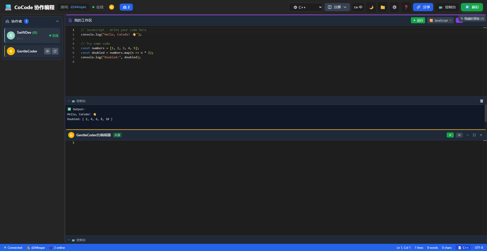

# CoCode - Real-time Collaborative Code Editor

<div align="center">

**[English](#english) | [中文](#中文)**



[](https://reactjs.org/)
[](https://www.typescriptlang.org/)
[](https://vitejs.dev/)
[](https://github.com/yjs/yjs)
[](LICENSE)

**🌐 Live Demo: [https://cocode.iziz.site](https://cocode.iziz.site)**

</div>

---

<a name="english"></a>
## 🇺🇸 English

### 🚀 Overview

CoCode is a powerful **real-time collaborative code editor** that enables multiple users to edit the same code simultaneously without conflicts. Built with modern web technologies and CRDT algorithms, it delivers a **sub-millisecond synchronization experience** perfect for pair programming, code interviews, and collaborative learning.

### ✨ Features

| Feature | Description |
|---------|-------------|
| 🤝 **Real-time Collaboration** | Multiple users edit simultaneously with conflict-free synchronization (Yjs CRDT) |
| 👥 **Live Cursors** | See other users' cursors and selections in real-time |
| 💻 **Monaco Editor** | Professional code editor (VS Code engine) with syntax highlighting |
| ▶️ **Code Execution** | Run code in 10+ languages via secure sandbox (Piston API) |
| 🔗 **Easy Sharing** | One-click room link sharing, no login required |
| 🌙 **Dark Theme** | Eye-friendly dark mode interface |
| 🌍 **i18n Support** | English and Chinese interface |
| 📱 **Responsive** | Works on desktop and mobile browsers |
| 📂 **File Import/Export** | Import and export code files |
| 🔒 **Editor Lock** | Lock editor to prevent accidental edits |

### 🛠️ Tech Stack

**Frontend:**
- React 18 + TypeScript + Vite
- Monaco Editor (VS Code engine)
- Yjs + y-websocket (CRDT real-time sync)
- Tailwind CSS

**Backend:**
- Node.js + WebSocket (ws)
- y-websocket server

### 📦 Quick Start

```bash
# Clone the repository
git clone https://github.com/Polaris418/cocode.git
cd cocode

# Install and start backend
cd cocode-backend
npm install
npm start

# Install and start frontend (new terminal)
cd cocode-frontend
npm install
npm run dev
```

Open http://localhost:5173 and start collaborating!

### 🎯 Usage

1. Open the app - a unique room ID is generated automatically
2. Click **"Share"** to copy the room link
3. Share the link with collaborators
4. Select programming language and start coding together!
5. Click **"Run"** to execute code and see output

### 📁 Project Structure

```
cocode/
├── cocode-frontend/     # React frontend
│   ├── src/
│   │   ├── components/  # UI components
│   │   ├── context/     # React context
│   │   ├── hooks/       # Custom hooks
│   │   └── i18n/        # Internationalization
│   └── ...
├── cocode-backend/      # WebSocket server
│   └── src/server.js
└── docs/                # Documentation
```

### 🚀 Deployment

See [DEPLOYMENT.md](DEPLOYMENT.md) for detailed deployment instructions.

**Quick Deploy:**
- Frontend: Vercel, Netlify, or any static hosting
- Backend: Railway, Heroku, or VPS with PM2

---

<a name="中文"></a>
## 🇨🇳 中文

### 🚀 项目简介

CoCode 是一个强大的**实时协作代码编辑器**，支持多用户同时编辑同一份代码，无需担心冲突。基于现代 Web 技术和 CRDT 算法构建，提供**亚毫秒级同步体验**，非常适合结对编程、代码面试和协作学习。

### ✨ 功能特性

| 功能 | 描述 |
|------|------|
| 🤝 **实时协作** | 多用户同时编辑，无冲突同步（Yjs CRDT） |
| 👥 **实时光标** | 看到其他用户的光标和选区 |
| 💻 **Monaco 编辑器** | 专业代码编辑器（VS Code 同款引擎），语法高亮 |
| ▶️ **代码执行** | 支持 10+ 种语言，安全沙箱执行（Piston API） |
| 🔗 **便捷分享** | 一键复制房间链接，无需登录 |
| 🌙 **暗色主题** | 护眼暗色界面 |
| 🌍 **多语言** | 支持中英文界面切换 |
| 📱 **响应式** | 支持桌面和移动端浏览器 |
| 📂 **文件导入导出** | 支持导入和导出代码文件 |
| 🔒 **编辑器锁定** | 锁定编辑器防止误操作 |

### 🛠️ 技术栈

**前端：**
- React 18 + TypeScript + Vite
- Monaco Editor（VS Code 同款引擎）
- Yjs + y-websocket（CRDT 实时同步）
- Tailwind CSS

**后端：**
- Node.js + WebSocket (ws)
- y-websocket 服务器

### 📦 快速开始

```bash
# 克隆仓库
git clone https://github.com/Polaris418/cocode.git
cd cocode

# 安装并启动后端
cd cocode-backend
npm install
npm start

# 安装并启动前端（新终端）
cd cocode-frontend
npm install
npm run dev
```

打开 http://localhost:5173 开始协作！

### 🎯 使用方法

1. 打开应用 - 自动生成唯一房间 ID
2. 点击 **「分享」** 复制房间链接
3. 将链接分享给协作者
4. 选择编程语言，开始一起编程！
5. 点击 **「运行」** 执行代码查看输出

### 📁 项目结构

```
cocode/
├── cocode-frontend/     # React 前端
│   ├── src/
│   │   ├── components/  # UI 组件
│   │   ├── context/     # React 上下文
│   │   ├── hooks/       # 自定义 Hooks
│   │   └── i18n/        # 国际化
│   └── ...
├── cocode-backend/      # WebSocket 服务器
│   └── src/server.js
└── docs/                # 文档
```

### 🚀 部署

查看 [DEPLOYMENT.md](DEPLOYMENT.md) 获取详细部署说明。

**快速部署：**
- 前端：Vercel、Netlify 或任何静态托管
- 后端：Railway、Heroku 或 VPS + PM2

---

## 📄 License

MIT License - feel free to use this project for learning and development!

## 🤝 Contributing

Contributions are welcome! Please feel free to submit a Pull Request.

## 📧 Contact

- GitHub: [@Polaris418](https://github.com/Polaris418)
- Demo: [https://cocode.iziz.site](https://cocode.iziz.site)
